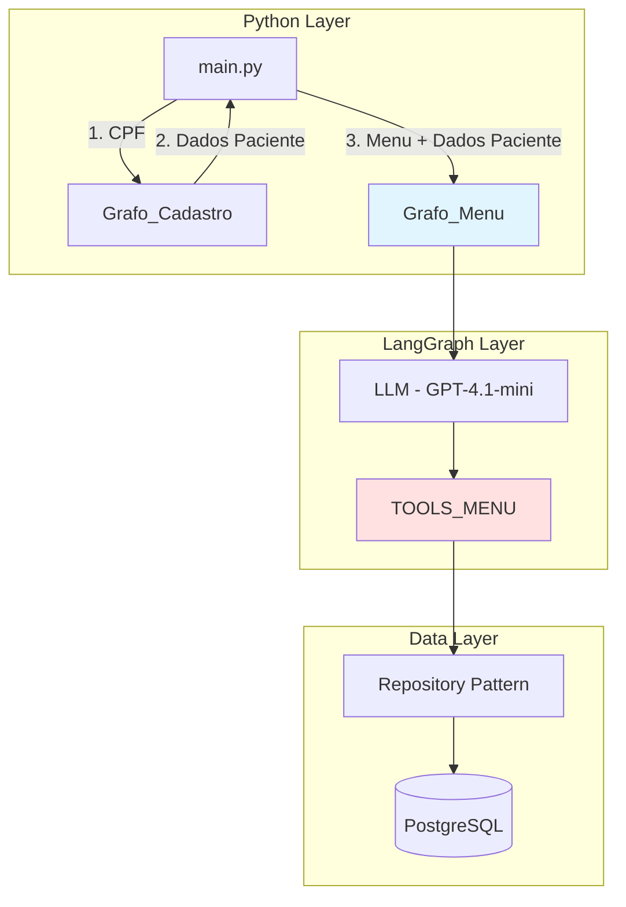
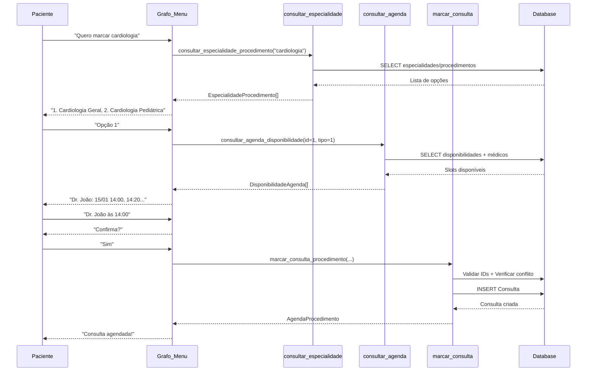
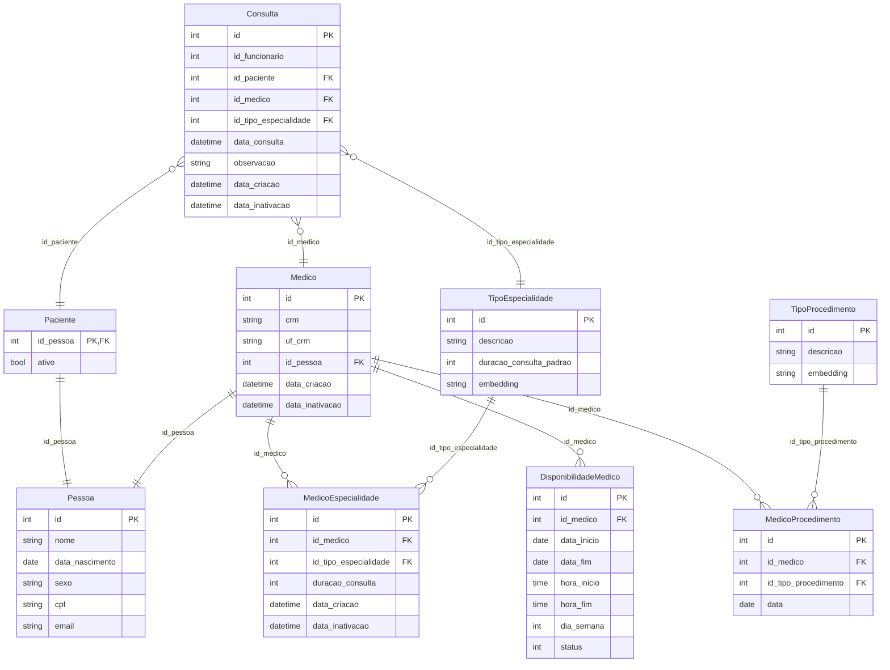
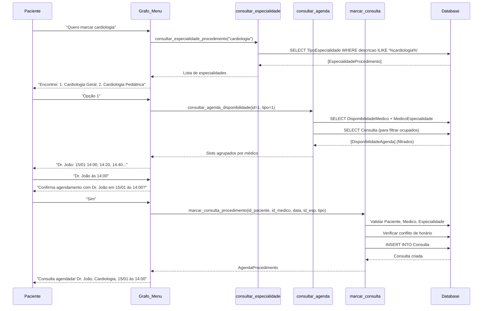

# Design Document: Marcar Consulta

## Overview

O fluxo de Marcar Consulta utiliza a infraestrutura existente do sistema (grafo menu, tools e state) para gerenciar o agendamento conversacional de consultas médicas. O design foca em melhorias incrementais nas tools existentes e validações de negócio, mantendo a simplicidade da arquitetura atual.

### Princípios de Design

1. **Reutilizar infraestrutura existente**: Usar `configure_graph_menu()` e `TOOLS_MENU`
2. **Melhorar validações**: Adicionar verificações de conflito e validações de dados
3. **Manter simplicidade**: Não criar novos grafos ou abstrações desnecessárias
4. **Focar em correção**: Garantir que as tools funcionem corretamente com validações adequadas

### Escopo do Fluxo

O fluxo de marcar consulta abrange:
- Busca de especialidades e procedimentos médicos (tool existente)
- Consulta de disponibilidade de médicos em slots de 20 minutos (tool existente)
- Seleção de médico, data e horário via conversa
- Criação da consulta no banco com validações (melhorar tool existente)
- Tratamento de conflitos de horário (adicionar à tool existente)

## Architecture

### Current Architecture (Reused)



### Marcar Consulta Flow



## Components and Interfaces

### 1. Tools Existentes (Melhorias Necessárias)

As tools já existem em `src/ia/tools.py` como parte de `TOOLS_MENU`. O design foca em melhorar a implementação existente.

#### consultar_especialidade_procedimento

**Status**: Implementada, funcional
**Melhorias**: Nenhuma necessária

```python
@tool
def consultar_especialidade_procedimento(especialidade: str):
    """Lista especialidades/procedimentos disponíveis."""
    # Implementação existente está correta
```

#### consultar_agenda_disponibilidade

**Status**: Implementada, precisa correção
**Problema**: Não exclui horários já ocupados por consultas existentes
**Melhoria Necessária**: Adicionar filtro para excluir slots com consultas

```python
@tool
def consultar_agenda_disponibilidade(
    id_especialidade_procedimento: int, tipo: int
) -> list[dict[str, Any]]:
    """Lista slots disponíveis excluindo horários ocupados."""
    # ... código existente para gerar slots ...
    
    # ADICIONAR: Buscar consultas existentes
    consultas_existentes = session.query(Consulta).filter(
        Consulta.id_medico.in_(medicos_ids),
        Consulta.data_consulta >= hoje,
        Consulta.data_consulta <= limite,
        Consulta.data_inativacao.is_(None)
    ).all()
    
    # ADICIONAR: Filtrar slots ocupados
    consultas_set = {(c.id_medico, c.data_consulta) for c in consultas_existentes}
    slots_filtrados = [
        s for s in slots 
        if (s.id_medico, s.data) not in consultas_set
    ]
    
    # Continuar com agrupamento e ordenação
```

#### marcar_consulta_procedimento

**Status**: Implementada, precisa validações
**Problema**: Não valida IDs, não verifica conflitos
**Melhorias Necessárias**: Adicionar todas as validações

```python
@tool
def marcar_consulta_procedimento(
    id_paciente: int,
    id_medico: int,
    dia: datetime,
    id_especialidade_procedimento: int,
    tipo: int,
) -> AgendaProcedimento | dict:
    """Marca consulta com validações completas."""
    
    if tipo == 1:  # Especialidade
        with get_session() as session:
            # ADICIONAR: Validação de paciente
            paciente = session.get(Paciente, id_paciente)
            if not paciente:
                return {"error": "Paciente não encontrado", "code": "INVALID_PATIENT"}
            
            # ADICIONAR: Validação de médico
            medico = session.get(Medico, id_medico)
            if not medico:
                return {"error": "Médico não encontrado", "code": "INVALID_DOCTOR"}
            
            # ADICIONAR: Validação de especialidade
            especialidade = session.get(TipoEspecialidade, id_especialidade_procedimento)
            if not especialidade:
                return {"error": "Especialidade não encontrada", "code": "INVALID_SPECIALTY"}
            
            # ADICIONAR: Validação de janela de tempo
            hoje = datetime.now().date()
            limite = hoje + timedelta(days=14)
            if not (hoje <= dia.date() <= limite):
                return {"error": "Data fora da janela de agendamento", "code": "INVALID_DATE"}
            
            # ADICIONAR: Verificação de conflito
            conflito = session.query(Consulta).filter(
                Consulta.id_medico == id_medico,
                Consulta.data_consulta == dia,
                Consulta.data_inativacao.is_(None)
            ).first()
            
            if conflito:
                return {"error": "Horário já ocupado", "code": "SLOT_OCCUPIED"}
            
            # Criar consulta (código existente)
            repo = Repository(session, Consulta)
            consulta = Consulta(
                id_funcionario=1,
                id_medico=id_medico,
                id_paciente=id_paciente,
                id_tipo_especialidade=id_especialidade_procedimento,
                data_consulta=dia,
                data_criacao=datetime.now(),
                observacao=None,
            )
            repo.add(consulta)
            
            return AgendaProcedimento(
                data=dia,
                id_agenda=consulta.id,
                id_especialidade=id_especialidade_procedimento,
                id_procedimento=None,
            )
```

### 2. SYSTEM_MESSAGE (Já Existe)

O `SYSTEM_MESSAGE` em `src/ia/prompt.py` já contém instruções para marcar consulta. Não é necessário criar um novo prompt.

**Conteúdo Atual**: Já inclui fluxo completo de marcar consulta com:
- Solicitar especialidade
- Chamar consultar_especialidade_procedimento
- Apresentar opções
- Chamar consultar_agenda_disponibilidade
- Apresentar horários
- Chamar marcar_consulta_procedimento

**Ação**: Nenhuma mudança necessária no prompt.

### 3. State Management (Já Implementado)

O `State` existente em `src/ia/state.py` já suporta o fluxo:

```python
class State(TypedDict):
    messages: Annotated[Sequence[BaseMessage], add_messages]
    paciente: NotRequired[Cliente | None]
```

**Ação**: Nenhuma mudança necessária no state.

### 4. Grafo Menu (Já Implementado)

O `configure_graph_menu()` em `src/ia/graph.py` já está configurado corretamente com `TOOLS_MENU`.

**Ação**: Nenhuma mudança necessária no grafo.

## Data Models

### Entidades do Banco de Dados



### Modelos de Dados das Tools

**EspecialidadeProcedimento** (retorno de consultar_especialidade_procedimento):
```python
class EspecialidadeProcedimento(BaseModel):
    id_especialidade_procedimento: int  # ID da especialidade ou procedimento
    nome: str                            # Nome descritivo
    tipo: int                            # 1=Especialidade, 2=Procedimento
```

**DisponibilidadeAgenda** (retorno de consultar_agenda_disponibilidade):
```python
class DisponibilidadeAgenda(BaseModel):
    id_medico: int
    id_especialidade_procedimento: int
    nome_medico: str | None
    tipo: int                            # 1=Especialidade, 2=Procedimento
    data: datetime                       # Data/hora do slot
```

**AgendaProcedimento** (retorno de marcar_consulta_procedimento):
```python
class AgendaProcedimento(BaseModel):
    id_agenda: int                       # ID da consulta criada
    data: datetime                       # Data/hora agendada
    id_especialidade: int                # ID da especialidade
    id_procedimento: int | None          # ID do procedimento (se aplicável)
```

### Fluxo de Dados




## Correctness Properties

*A property is a characteristic or behavior that should hold true across all valid executions of a system—essentially, a formal statement about what the system should do. Properties serve as the bridge between human-readable specifications and machine-verifiable correctness guarantees.*

### Property 1: Search Results Match Query Term

*For any* search term and database state, all returned specialties and procedures should have names that contain the search term (case-insensitive), and no matching items should be excluded.

**Validates: Requirements 4.2, 4.3**

### Property 2: Search Results Have Required Structure

*For any* search result from consultar_especialidade_procedimento, the result should contain id_especialidade_procedimento (unique identifier), nome (non-empty string), and tipo (1 or 2).

**Validates: Requirements 4.4**

### Property 3: Available Slots Within Time Window

*For any* query to consultar_agenda_disponibilidade, all returned slots should have dates within 14 days from the current date, and no slots outside this window should be included.

**Validates: Requirements 5.4**

### Property 4: Slot Interval Consistency

*For any* generated availability slots for a single doctor on a single day, consecutive slots should be exactly 20 minutes apart.

**Validates: Requirements 5.5**

### Property 5: Slots Match Availability Constraints

*For any* generated slot, the slot's datetime should fall on a weekday matching the DisponibilidadeMedico.dia_semana, and the time should be within the DisponibilidadeMedico.hora_inicio and hora_fim range.

**Validates: Requirements 5.6, 5.7, 5.8**

### Property 6: Slots Grouped and Sorted Correctly

*For any* result from consultar_agenda_disponibilidade, the results should be grouped by id_medico, and within the entire result set, slots should be ordered first by date, then by id_medico.

**Validates: Requirements 5.9, 5.10**

### Property 7: Consulta Creation Persistence

*For any* valid appointment request (valid patient, doctor, specialty, and datetime), calling marcar_consulta_procedimento should create a Consulta record in the database that can be retrieved with matching data.

**Validates: Requirements 6.2, 6.6**

### Property 8: Consulta Field Correctness

*For any* Consulta created via marcar_consulta_procedimento, the record should have id_funcionario=1, data_criacao within 5 seconds of current time, and all provided fields (id_paciente, id_medico, id_tipo_especialidade, data_consulta) should match the input parameters.

**Validates: Requirements 6.3, 6.4, 6.5**

### Property 9: Invalid Patient ID Rejection

*For any* appointment request with an id_paciente that does not exist in the database, the system should reject the request and return an error message.

**Validates: Requirements 7.1**

### Property 10: Invalid Doctor ID Rejection

*For any* appointment request with an id_medico that does not exist in the database, the system should reject the request and return an error message.

**Validates: Requirements 7.2**

### Property 11: Invalid Specialty ID Rejection

*For any* appointment request with an id_tipo_especialidade that does not exist in the database, the system should reject the request and return an error message.

**Validates: Requirements 7.3**

### Property 12: Date Window Validation

*For any* appointment request with a datetime outside the 14-day window (past or more than 14 days in future), the system should reject the request and return an error message.

**Validates: Requirements 7.4**

### Property 13: Validation Error Messages

*For any* validation failure (invalid IDs, invalid date, etc.), the system should return a descriptive error message indicating which validation failed.

**Validates: Requirements 7.5**

### Property 14: Successful Appointment Return Structure

*For any* successful appointment creation, the return value should be valid JSON containing id_consulta, id_medico, nome_medico, especialidade, data, and horário fields.

**Validates: Requirements 9.1, 9.2**

### Property 15: Error Return Structure

*For any* error during the appointment process, the system should return valid JSON with an error field containing a descriptive message.

**Validates: Requirements 9.4**

### Property 16: Database Transaction Rollback

*For any* database error during Consulta creation, the transaction should be rolled back completely, leaving no partial or inconsistent state in the database.

**Validates: Requirements 11.4**

### Property 17: Required Fields Populated

*For any* Consulta record created in the database, all required fields (id_funcionario, id_paciente, id_tipo_especialidade, data_consulta, data_criacao) should be non-null.

**Validates: Requirements 11.5**

### Property 18: No Slot Conflicts in Availability

*For any* result from consultar_agenda_disponibilidade, none of the returned slots should overlap with existing Consulta records for the same doctor.

**Validates: Requirements 12.1**

### Property 19: Occupied Slot Rejection

*For any* attempt to create a Consulta at a datetime where the specified doctor already has an existing Consulta, the system should reject the request and return an error message.

**Validates: Requirements 12.2, 12.5**

### Property 20: Graph Returns Structured Data

*For any* execution of Grafo_Marcar_Consulta that reaches completion (success, cancellation, or error), the return value should be valid JSON with a status indicator.

**Validates: Requirements 1.6**

### Property 21: Structured JSON Return Format

*For any* invocation of the graph, the return should be parseable as JSON and contain at minimum a status field indicating the outcome type.

**Validates: Requirements 1.6, 9.1**

## Error Handling

### Error Categories

1. **Validation Errors**: Invalid IDs, date outside window, missing fields
2. **Business Logic Errors**: Slot occupied, doctor unavailable
3. **Database Errors**: Connection/transaction failures

### Error Handling Implementation

Errors são retornados como dicts com campos `error` e `code`:

```python
# Exemplo de retorno de erro
{"error": "Paciente não encontrado", "code": "INVALID_PATIENT"}
{"error": "Horário já ocupado", "code": "SLOT_OCCUPIED"}
{"error": "Data fora da janela de agendamento", "code": "INVALID_DATE"}
```

O LLM detecta esses retornos e comunica ao usuário de forma amigável.

### Rollback Automático

O context manager `get_session()` garante rollback em caso de erro:

```python
@contextmanager
def get_session():
    session = Session()
    try:
        yield session
        session.commit()
    except Exception:
        session.rollback()  # Automático
        raise
    finally:
        session.close()
```

## Testing Strategy

### Dual Testing Approach

1. **Property-Based Tests** (Hypothesis): Verificam propriedades universais com dados gerados
2. **Unit Tests** (pytest): Verificam exemplos específicos e casos extremos

### Property-Based Testing Configuration

**Framework**: Hypothesis
**Configuração**: Mínimo 100 iterações por teste
**Tag format**: `# Feature: marcar-consulta, Property {number}: {property_text}`

### Exemplos de Testes

**Property Test - Slots dentro da janela de 14 dias**:
```python
from hypothesis import given, strategies as st

# Feature: marcar-consulta, Property 3
@given(
    id_especialidade=st.integers(min_value=1, max_value=100),
    tipo=st.sampled_from([1, 2])
)
def test_slots_within_14_day_window(id_especialidade, tipo):
    hoje = datetime.now().date()
    limite = hoje + timedelta(days=14)
    
    results = consultar_agenda_disponibilidade(id_especialidade, tipo)
    
    for medico_slots in results:
        for slot_data in medico_slots["datas"]:
            assert hoje <= slot_data.date() <= limite
```

**Property Test - Prevenção de double-booking**:
```python
# Feature: marcar-consulta, Property 19
@given(
    id_paciente=st.integers(min_value=1, max_value=1000),
    id_medico=st.integers(min_value=1, max_value=100),
)
def test_double_booking_prevention(id_paciente, id_medico):
    dia = datetime.now() + timedelta(days=1)
    
    # Primeira consulta
    result1 = marcar_consulta_procedimento(id_paciente, id_medico, dia, 1, 1)
    
    # Segunda tentativa no mesmo horário
    result2 = marcar_consulta_procedimento(id_paciente + 1, id_medico, dia, 1, 1)
    
    # Deve rejeitar
    assert isinstance(result2, dict) and "error" in result2
    assert result2["code"] == "SLOT_OCCUPIED"
```

**Unit Test - Validação de ID inválido**:
```python
def test_invalid_patient_id_error():
    result = marcar_consulta_procedimento(
        id_paciente=999999,  # Não existe
        id_medico=1,
        dia=datetime.now() + timedelta(days=1),
        id_especialidade_procedimento=1,
        tipo=1
    )
    assert isinstance(result, dict)
    assert result["code"] == "INVALID_PATIENT"
```

### Test Organization

```
tests/
├── unit/
│   ├── test_tools.py
│   └── test_validations.py
└── property/
    ├── test_availability_properties.py
    ├── test_booking_properties.py
    └── test_conflict_properties.py
```

### Running Tests

```bash
# Todos os testes
pytest

# Apenas property tests
pytest -m property_test

# Com cobertura
pytest --cov=src
```
